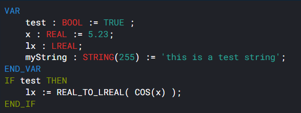

# ST Language Support

[](https://greenkeeper.io/)

This repository provides syntax highlighting for Highlight.js for Structured Text. ST is one of the 6 languages of IEC 61131-3 standard developed in 1998 for developing PLC programs.

We want to provide ST syntax highlights in VS Code Markdown editor and Markdown preview. And other cases when tutorials are published in the web.

## Install

    npm i highlightjs-structured-text --save

## Usage

Include the `highlight.js` script package in your webpage or node app, load this module and register it with `hljs`. Follow instructions at [highlightjs](https://highlightjs.org/) to learn how to include the library and CSS.

If you're not using a build system and just want to embed this in your webpage:

```html
<script type="text/javascript" src="/path/to/highlight.pack.js"></script>
<script type="text/javascript" src="/path/to/highlightjs-structured-text/iecst.js"></script>
<script type="text/javascript">
    hljs.registerLanguage('iecst', window.hljsDefineIECST);
    hljs.initHighlightingOnLoad();
</script>
```

If you're using webpack / rollup / browserify / node:

```javascript
var hljs = require('highlightjs');
var hljsDefineCUrl = require('highlightjs-structured-text');

hljsDefineIECST(hljs);
hljs.initHighlightingOnLoad();
```

Mark the code you want to highlight with the iecst class:

```html
<pre><code class="iecst">...</code></pre>
```

or use JavaScript to dynamically highlight text:

```javascript
hljs.registerLanguage('iecst', window.hljsDefineIECST);
var highlighted = hljs.highlightAuto(text, ["iecst"]);
```

## Example in Markdown-Generated Presentation
#### (using [marp](https://marp.app/))

Craft the IEC 61131 code that is desired and wrap it in a code-block defined with the tripple-backtick (`` ``` ``) and language as `iecst`.

````markdown
```iecst
VAR
    test : BOOL := TRUE ;
    x : REAL := 5.23;
    lx : LREAL;
    myString : STRING(255) := 'this is a test string';
END_VAR
IF test THEN
    lx := REAL_TO_LREAL( COS(x) );
END_IF
```
````

This will thus render as:


